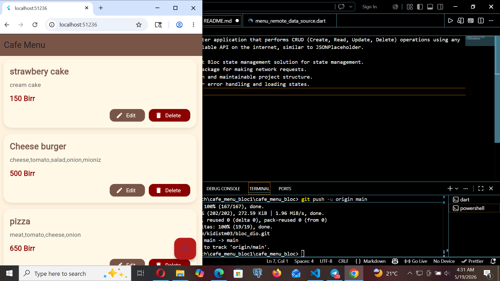

Create a Flutter application that performs CRUD (Create, Read, Update, Delete) operations using any publicly available API on the internet, similar to JSONPlaceholder.
Requirements:
Use the latest Bloc state management solution for state management.
Use the dio package for making network requests.
Follow a clean and maintainable project structure.
Include proper error handling and loading states.
